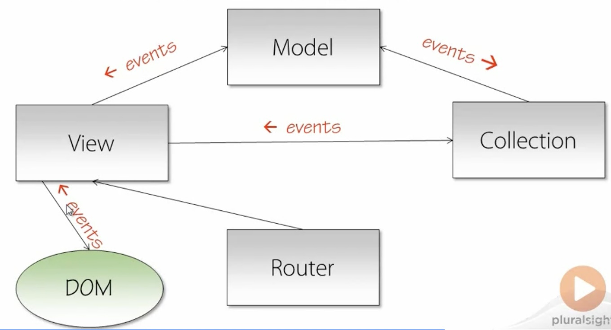
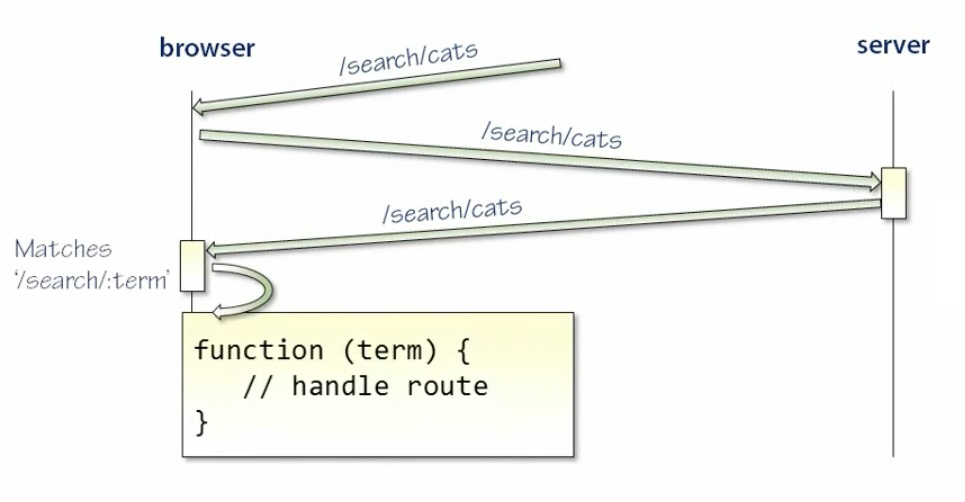
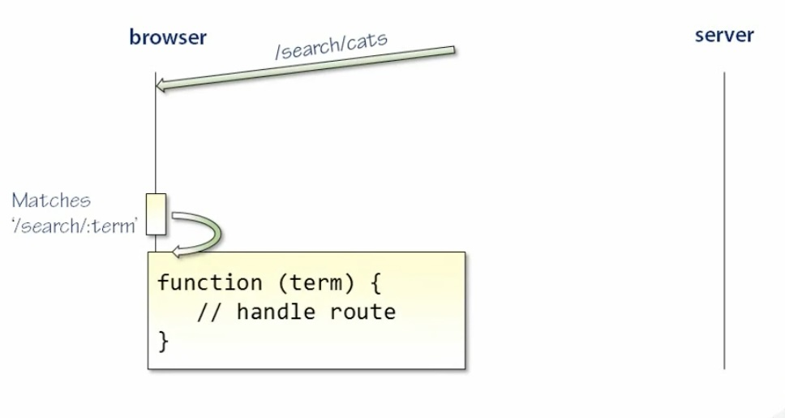

<!-- START doctoc generated TOC please keep comment here to allow auto update -->
<!-- DON'T EDIT THIS SECTION, INSTEAD RE-RUN doctoc TO UPDATE -->
**Table of Contents**  *generated with [DocToc](https://github.com/thlorenz/doctoc)*

- [Backbone.js Fundamentals](#backbonejs-fundamentals)
  - [Intro](#intro)
  - [Models](#models)
    - [Purpose of Models](#purpose-of-models)
    - [Defining New Model Types](#defining-new-model-types)
    - [Instantiating Models](#instantiating-models)
    - [Inheritance](#inheritance)
    - [Attributes](#attributes)
    - [Events](#events)
    - [Identity](#identity)
    - [Defaults](#defaults)
    - [Validation](#validation)
    - [toJSON](#tojson)
    - [save, fetch, and destroy](#save-fetch-and-destroy)
  - [Views](#views)
    - [Instantiating Views](#instantiating-views)
    - [The el Property](#the-el-property)
    - [render](#render)
    - [make](#make)
    - [events](#events-1)
    - [View Guidelines](#view-guidelines)
  - [Templating](#templating)
    - [Overview](#overview)
    - [Underscore Templates](#underscore-templates)
    - [Handlebars Templates](#handlebars-templates)
    - [Precompilation](#precompilation)
  - [Routing](#routing)
    - [Client-Side Routing](#client-side-routing)
    - [A Document Router Demo](#a-document-router-demo)
    - [Defining Routes](#defining-routes)
    - [Push State and Hash Fragments](#push-state-and-hash-fragments)
  - [Collections](#collections)
    - [Defining New Collection Types](#defining-new-collection-types)

<!-- END doctoc generated TOC please keep comment here to allow auto update -->

# Backbone.js Fundamentals

Learning Backbone with Pluralsight. [Docs](https://backbonejs.org/#)

## Intro

Course using Backbone.js v0.9.2, should work up to v 1.4.0

Latest as of 2024-08-28 is https://www.npmjs.com/package/backbone/v/1.6.0

Backbone is not a *framework* and not MVC, not MVVM.

Backbone is a *library* of tools to help build a richer web.

NOTE: A framework calls your code, whereas with libraries, your code calls the library.

Frameworks control how you design app - eg where what kind of files should go, and how to do things. Useful for getting started quickly, but not very flexible.

Provides structure to web apps with:
1. Models with key-value bindings and custom events
2. Collections with enumerable functions
3. Views with declarative event handling
4. Connects to a REST style JSON API

It's about moving state away from back-end/server and into client/browser.

**Anatomy of a Backbone.js Application**

When user navigates to app on their browser, the entire app is downloaded to their computer.

App consists of:
* Router(s) for handling page transitions
* View(s) for rendering models
* Model(s) for representing data in application
* Collection(s) for managing many models at once

Server is responsible for serving initial application, then providing RESTful endpoints serving JSON data over HTTP.

**Pros**

* Fast (initial cost of downloading entire app but can be cached for subsequent visits)
* JSON models transferred asynchronously so user hardly ever has to wait
* Highly interactive
* Scalable because a lot of work transferred to client, server only provides REST API

**Cons**

* Not indexed by search engines (requires additional effort)
* Difficult to test because most code depends on DOM, and there will be lots of interactions between components
* Security issues - entire app source is sent to all users

**Why Backbone?**



- Models represent data required by app
- Models hold app data, and raise events when data changes
- Collections group models, also forward events for models they contain, can also raise events of their own
- Collections depend on Models
- Backbone connects components indirectly via events
- Events travel in opposite direction to dependency shown
- Views handle events from Models and Collections
- Views responsible for rendering markup
- Views are the only Backbone component that interacts with the DOM
- Views can also handle events from DOM
- Routers simulate page changes, and provide support for page history and bookmarks

**Dependencies**

1. Underscore.js
2. jQuery (for DOM and ajax)

**Minimal Backbone.js Environment**

```htm
<!DOCTYPE html>
<html lang="en">
  <head>
    <meta charset="UTF-8" />
    <meta name="viewport" content="width=device-width, initial-scale=1.0" />
    <meta http-equiv="X-UA-Compatible" content="ie=edge" />
    <title>My App</title>

    <!-- jQuery 1.7.2 CDN -->
    <script src="https://code.jquery.com/jquery-1.7.2.min.js"></script>

    <!-- Underscore.js CDN -->
    <script src="https://cdnjs.cloudflare.com/ajax/libs/underscore.js/1.13.6/underscore-min.js"></script>

    <!-- Backbone.js CDN -->
    <script src="https://cdnjs.cloudflare.com/ajax/libs/backbone.js/1.4.1/backbone-min.js"></script>
  </head>
  <body>
  </body>
</html>
```

With the above running in the browser via a static web server `npx http-server`, open browser dev tools Console:

`Backbone` is an Object that is in scope. It has properties for Collection, Events, Model, Router, etc.

`Backbone.Model` is a function, function is a JavaScript constructor for creating new model objects. Eg:

```javascript
var book = new Backbone.Model({
  title: 'White Tiger',
  author: 'Aravind Adiga'
})
book.get('title') // White Tiger
book.set('title', 'The Stripey Tiger')
book.toJSON() // {title: 'The Stripey Tiger', author: 'Aravind Adiga'}
```

Backbone models do not store user provided attributes as properties on the object, rather they provide a `get` method that must be used. Similarly, use `set` method to write a property.

**A Backbone Example**

[Example](simple-example/index.html)

Let's build a simple app to render rectangles on a canvas. Rectangles will be Backbone models:
- rectangle has width and height
- rectangle has position
- rectangle has color

Will use a Backbone view for rendering a rectangle model.

Disable caching when running static server to immediately see js changes:
```bash
npx http-server -c-1
```

## Models

### Purpose of Models

- Models form core of application
- Contain state, logic, behaviour
- Single point of truth for data
- Provide a lifecycle
- Communicate state changes to app by raising events -> changes to a model can ripple through app without direct coupling

### Defining New Model Types

[Example](exercises/define-model-type/defineModelType.js)

* Create new Model types by extending Backbone.Model.
* Argument passed to `extend` method is an object containing configuration of new model type.
* Passing empty object `{}` results in a new model type that behaves exactly the same as `Backbone.Model`
* `extend()` function shared by Model, Collection, Router, View: Establishes inheritance relationship between two objects

```javascript
// `Vehicle` is a new constructor function that inherits from `Backbone.Model`
// Starts with uppercase `V` -> convention for constructor function naming in JS
var Vehicle = Backbone.Model.extend({
  prop1: '1'
})

// Create a few model instances
var v = new Vehicle();
var v2 = new Vehicle();

// modify a property
v.prop1 = 'one';

console.log(v.prop1) // one
console.log(v2.prop1) // 1
```

Can also define class properties with a second argument to `extend()`. They become available on the type rather than instances of the type:

```javascript
var Vehicle = Backbone.Model.extend({}, {
  summary: function() {
    return 'Vehicles are for travelling'
  }
})

Vehicle.summary() // Vehicles are for travelling
```

### Instantiating Models

To create a new model object, call its constructor function with the `new` operator

If there's nothing unique about your model, no need to define a custom model type, just use `Backbone.Model`:

```javascript
var myModel = new Backbone.Model()
```

Usually will be using custom types:

```javascript
var Vehicle = Backbone.Model.extend({})
var ford = new Vehicle()
```

Common pattern is to instantiate model with property values:

```javascript
var model = new Backbone.Model({
  name: 'Jane',
  age: 52
})
```

If model type has an `initialize` function, it gets called when model is instantiated:

```javascript
var Vehicle = Backbone.Model.extend({
  initialize: function() {
    console.log('vehicle created')
  }
})

var ford = new Vehicle() // vehicle created
```

### Inheritance

Models can inherit from other models:

```javascript
var Vehicle = Backbone.Model.extend({})
var Car = Vehicle.extend({})
```

```javascript
var A = Backbone.Model.extend({
  initialize: function() {
    console.log('initialize A')
  },

  asString: function() {
    return JSON.stringify(this.toJSON())
  }
})

var a = new A({
  one: '1',
  two: '2'
}) // initialize A
console.log(a.asString()) // {"one":"1","two":"2"}

var B = A.extend({})
var b = new B({
  three: '3'
}) // initialize A -> B inherits A's constructor
console.log(b.asString()) // {"three":"3"} -> B inherits A's asString function
```

Use `instanceof` operator to see the type of objects:

```javascript
console.log(b instanceof B) // true
console.log(b instanceof A) // true
console.log(b instanceof Backbone.Model) // true
console.log(a instanceof A) // true
console.log(a instanceof Backbone.Model) // true
console.log(a instanceof B) // false
```

### Attributes

Attributes hold a model's data.

Can be set by passing an object ot a model type's constructor, or using `set` method, which accepts a name and value:

```javascript
var ford = new Vehicle()
ford.set('type', 'car')
```

Can also set multiple properties at once:

```javascript
ford.set({
  'maximumSpeed': '99',
  'color': 'blue'
})
```

Access attribute values with `get` method:

```javascript
ford.get('type') // car
```

`escape` method is similar to `get`, but output is HTML escaped, useful for preventing XSS:

```javascript
ford.set('description', '<script>alert("script injection!"</script>')
ford.escape('description') // &lt;script&gt;alert(&quot;script injection!&quot;&lt;/script&gt;
```

**Demo**

```javascript
var Vehicle = Backbone.Model.extend({
  dump: function() {
    console.log(JSON.stringify(this.toJSON()))
  }
})

var v = new Vehicle({
  type: 'car'
})
v.dump() // {"type":"car"}

v.set('color', 'blue')
v.dump() // {"type":"car","color":"blue"}

v.set({
  description: "<script>alert('injection!')</script>",
  weight: 1750
})
v.dump() // {"type":"car","color":"blue","description":"<script>alert('injection!')</script>","weight":1750}

$('body').append(v.get('description')) // pops up browser alert box!
$('body').append(v.escape('description')) // outputs escaped value in the DOM
```

**Test for an Attribute**

Given a model object, how to know whether it contains an attribute or not? Use `has` predicate method:

```javascript
var ford = new Vehicle()
ford.set('type', 'car)
ford.has('type') // true
ford.has('year') // false
```

### Events

[Demo](exercises/demos/demos.js)

Models raise events when their state changes -> valuable feature.

This is why you have to use `get` and `set` functions when working with model attributes, so Backbone has a chance to raise events as part of these functions.

To detect a change to a model, listen for `change` event, using `on` function. First arg to `on` is event to listen for, second arg is function to execute when that event is triggered:

```javascript
ford.on('change', function() {
  // do something
})
```

`change` event is triggered anytime the model is changed.

Can also listen to change to a specific property using "event namespacing":

```javascript
ford.on('change:color', function() {
  // do something when color property of ford model instance has changed
})
```

Note that if color property of `ford` model is changed, will trigger *both* `change:color` and `change` events:

```javascript
var ford = new Backbone.Model({
  type: 'car',
  color: 'blue'
})

// bind event handler to change event
ford.on('change', function() {
  console.log('something changed')
})

// register another event handler, but only for changes to color attribute
ford.on('change:color', function() {
  console.log('color changed')
})

// trigger non-color event
ford.set('type', 'scooter') // something changed

// trigger color change event
ford.set('color', 'red') // color changed, something changed
```

**Custom Model Events**

[Example](exercises/custom-events/app.js)

Powerful tool for decoupling components.

Can define, trigger, and observe custom model events.

Events are identified by string identifiers.

Convention is to namespace events using `:`.

Use `on` method to bind to an event.

Second argument to `on` function is a callback that will be executed when event is triggered:

```javascript
ford.on('retired', function() {
  // do something when custom `retired` event is triggered
})
```

Use `trigger` method to trigger a custom event. Any arguments following event name are forwarded to event handler:

```javascript
ford.trigger('retired')
```

There's also an `off` method to remove event handler.

`on`, `off`, and `trigger` methods are provided by [Backbone.Events](https://backbonejs.org/#Events) module. Can be included in any JavaScript object, not just Backbone Models.

```javascript
// Using underscore's extend function, which is similar to Backbone's extend
// We extend an empty object, then mixin Backbone.Events
var volcano = _.extend({}, Backbone.Events)
// now volcano has functions: bind, off, on, once, trigger, unbind, etc

// Register an event handler for a custom event
// Using namespacing convention: The event is `eruption` and it's in the `disaster` namespace
volcano.on('disaster:eruption', function(options) {
  if (options) {
    console.log('duck and cover - ' + options.plan)
  } else {
    console.log('duck and cover')
  }
})

// Trigger our custom event
volcano.trigger('disaster:eruption') // duck and cover

// Can also forward additional arguments to event handler
volcano.trigger('disaster:eruption', {plan: 'run'}) // duck and cover - run

// Remove all event handlers for the `disaster:eruption` event
volcano.off('disaster:eruption')
volcano.trigger('disaster:eruption') // nothing happens
```

### Identity

**Model Identity**

`id` property is model's persistent identity and is unique.

`id` is `undefined` until model has been saved, meaning saved on server, at this point, the model's `id` gets populated with the server's `id` for this model.

`cid` is temporary identifier used until model gets assigned `id`

Model objects have `isNew()` function to test if model has `id` or not, i.e. has it been saved to server or not.

```javascript
var ford = new Backbone.Model({})
ford.id // undefined
ford.cid // c0
ford.isNew() // true
```

### Defaults

`defaults` property specifies default values for attributes that are not set in the constructor.

Useful for documenting a model type's properties.

```javascript
var Vehicle = Backbone.Model.extend({
  defaults: {
    'color': 'white',
    'type': 'car'
  }
})

// Create a new Vehicle model, but do not initialize any values in constructor.
var car = new Vehicle()
car.get('color') // white
car.get('type') // car
```

### Validation

[Example](exercises/validation/app.js)

Backbone provides two functions for model validation:

1. `validate` Tests validity of model and returns errors if any are found.
2. `isValid` Returns boolean true/false if model is currently valid according to the `validate` method

A model can become invalid for example, if `set(...)` is called in a way that does not trigger validation.

`validate` is called by Backbone prior to performing `set` or `save` operations.

Actually, requires `{validate: true}` option passed to `set` if you want to trigger validation. See [Model validate docs](https://backbonejs.org/#Model-validate) for details.

If call `save` and model is invalid, operation is cancelled and error event is triggered on model.

To add validation on model, must provide implementation of `validate` method when declaring model type.

`validate` method will be called with a hash of the model instance's attributes.

Must register an error event handler on the model instance to detect validation issues.

Callback that handles validation errors gets called with a reference to the model instance that raised the error, and the error. TODO: What if there's more than one validation error???

```javascript
var Vehicle = Backbone.Model.extend({
  validate: function (attrs) {
    console.log('=== RUNNING VEHICLE VALIDATION ===')
    // Define array of valid colors
    var validColors = ['white', 'red', 'blue', 'yellow']

    // Define function to validate model color
    var colorIsValid = function(attrs) {
      // if `color` attribute is not set, that's valid
      if (!attrs.color) return true

      // return true only if the model's color is one of validColors
      return _(validColors).include(attrs.color)
    }

    // Now we can use the colorIsValid function
    if (!colorIsValid(attrs)) {
      return "color must be one of: " + validColors.join(", ")
    }
  }
})

var car = new Vehicle()

// Used to be `error`, now its `invalid`
car.on('invalid', function(model, error) {
  console.log(error)
  // handle validation errors here
})

// no validation errors because we don't have any rules for the `foo` attribute
car.set('foo', 'bar')
console.log(car.isValid()) // true

// populate a valid color
car.set('color', 'blue')
console.log(car.isValid()) // true
console.log(car.get('color')) //blue

// populate a invalid color
car.set('color', 'pink')
console.log(car.isValid()) // false, color must be one of: white, red, blue, yellow
console.log(car.get('color')) // pink -> in this case, it did populate an invalid color

// try validate option
car.set('color', 'mauve', {validate: true}) // color must be one of: white, red, blue, yellow
console.log(car.get('color')) // pink -> because we passed validate option, it hangs on to last set color
```

### toJSON

Converts a model's attributes to a JavaScript object.

**NOTE:** Does NOT return a JSON string representation of the model as one might expect from the function name!

It returns an object containing copies of the model's attributes.

Useful as a first step in serializing a model or when you just want to inspect the model's state.

Object returned from `toJSON()` can be passed to `JSON.stringify(...)` to get a JSON string representation of the model.

```javascript
var ford = new Vehicle()
ford.set('type', 'car')
var attrs = ford.toJSON()
console.log(attrs) // { type: 'car' }
console.log(JSON.stringify(attrs)) // "{"type": "car"}"
```

### save, fetch, and destroy

`save`, `fetch` and `destroy` methods are for synchronizing the model's state with the server.

`save` performs insert or update, depending on state of the model:
* If model is new and has never been saved to server before, `save` will perform an insert on server.
* If model is existing and has previously been inserted, `save` will perform an update on server.

`fetch` updates model with server-side state

`destroy` deletes model from server

## Views

Views serve as interface (bi-directional) between HTML document and Backbone models and collections.

Views make up majority of Backbone code.

Views bind model(s) to document -> provides "glue" between models and document.

Backbone recommends:

- Organize the UI into logical views
- Where views are backed by models
- Each view should be updated independently when the model changes, without having to re-render the entire page

Views can handle model change events, and DOM events.

Views depend on models.

Models trigger events that view can handle.

Views also depend on the DOM.

DOM can raise events that view can handle.

**Defining New View Types**

Extend `Backbone.View`. Can create inheritance hierarchy just like with Models.

```javascript
var VehicleListView = Backbone.View.extend({
  // properties
})
```

Every view has an associated DOM element available in `.el` property.

DOM element is passed to view in constructor or created by the view.

**Views that Create New Elements**

[Example](exercises/views/app.js)

New element defined by id, tagName, className, and attributes:

```javascript
var V = Backbone.View.extend({
  tagName: 'li',
  id: 'thing',
  className: 'active',
  attributes: {
    'data-value': 12345
  }
})

var v = new V()
$('body').prepend(v.el)

// Renders markup
// <body>
//   <li data-value="12345" id="thing" class="active"></li>
// </body>
```

**Views that Attach to Existing Elements**

[Example](exercises/views2/app.js)

Pass `el` property to view's constructor:

```javascript
var V = Backbone.View.extend({})
var v = new V({el: '#test'})
v.$el.css('background-color', 'CornflowerBlue')
```

Given the markup with an element of id test:
```htm
<div id="test">
  Test content
</div>
```

This would change the test div background to blue.

### Instantiating Views

[Example](exercises/views3/app.js)

Like Models, to create a new view object, call its constructor function with `new` operator

Simplest case is instance of Backbone.View:

```javascript
var view = new Backbone.View()
```

Usually you'll want your own custom view type(s).

```javascript
var VehicleListView = Backbone.View.extend({})
var myView = new VehicleListView()
```

Usually you'll pass a model instance to the view constructor:

```javascript
var VehicleListView = Backbone.View.extend({})
var myView = new VehicleListView({
  model: myModelObject
})
```

Any of the below properties will be attached to view object if passed to view constructor:

* model
* collection
* el
* id
* className
* tagName
* attributes

```javascript
var myModel = new Backbone.Model()
myModel.set('content', 'this is some content')

// Creates a new DOM element
var myView = new Backbone.View({
  model: myModel,
  className: 'model-object'
})

$('body').prepend(myView.el)

// Creates markup
// <body>
//  <div class="model-object"></div>
//  <div id="test"> Test content </div>
// </body>
```

### The el Property

[Example](exercises/views4/app.js)

All views have `el` property that references the views' DOM element.

Every view maps to exactly one DOM element, this element may or may not have already been added to the document.

```javascript
// create a new view, passing in a selector, in this case, we select the body element
// any valid jQuery selector is allowed
var v = new Backbone.View({el: 'body'})
v.el // <body></body>
```

**$el**

Another important view property: `$el` is the cached jQuery wrapper around `el`.

Useful to avoid repeatedly calling `$(this.el)`.

```javascript
var v = new Backbone.View({el: 'body'})
console.log(v.el) // <body>...</body>
console.log(v.$el)
console.log(v.$el.html()) // inside contents of body: <div id="test">...</div>
```

**this.$**

`this.$` is the jQuery function scoped to the current view.

`this.$('selector')` === `this.$el.find('selector')`

Using `this.$` means the jQuery selectors you use don't need to be unique for the whole page, only for that view.

### render

`render()` function renders views element `.el`, usually based on view's model data.

Default implementation is no-op, you should provide an implementation with your view definitions that generates the markup you require.

By convention, the render method returns `this`, which is the view instance? Makes it easy to chain method calls.

```javascript
var V = Backbone.View.extend({
  render: function () {
    this.$el.html('some content')
    return this
  }
})
```

**Combining Views and Models**

[Example](exercises/views5/app.js)

Generating markup from models and binding views to model's change events -> Core Backbone development.

Pass model to views's constructor:

```javascript
var v = new View({
  model: myModel
})
```

Bind the view's render method - this is a common pattern where event handler is attached to model change, and view is rendered by this handler:

```javascript
myModel.on('change', function() {
  $('body').append(v.render().el)
})
```

A given model can provide data for many views. If any changes occur to the model, all the bound views are automatically updated.

```javascript
// a view that auto refreshes when its model data changes
// use `initialize` method to setup binding to the model
// `this.model` is how to reference the view's model
// when the model changes, we want to re-render the view
// need to pass the view object `this` to the model's `on` method to set the context for the event handler
var RefreshingView = Backbone.View.extend({
  initialize: function() {
    this.model.on('change', function() {
      this.render();
    }, this)
  },

  // access the views jQuery wrapped element with `this.$el`
  // use jQuery's `html` function to replace the contents of the element
  // specifically we replace the content with the model's `text` property.
  render: function() {
    this.$el.html(this.model.get('text'))
  }
})

// Create a new model with a `text` property that is the current date
var m = new Backbone.Model({
  text: new Date().toString()
})

// Create an instance of the RefreshingView with the model we just created
// And the element being the document body
var rf = new RefreshingView({
  model: m,
  el: 'body'
})

// Now let's render the view
rf.render()

// To demonstrate auto updating view, use a timer to keep updating the model every second
setInterval(() => {
  m.set('text', new Date().toString())
}, 1000);

// Renders and updates every one second:
// <body>
//  <text>Thu Sep 12 2024 08:37:20 GMT-0400 (Eastern Daylight Time)</text>
// </body>

// Refreshing page updates the date display
// NOTE: <text>...</text> is NOT a valid html element
```

### make

NOTE: Doesn't work anymore? Can't find in docs and getting JS error

`make` method: Use when need a lightweight technique for generating DOM elements, without templates.

Requires three arguments:
1. Type of element to create
2. Attributes to set on element
3. Value of element

[Example](exercises/views6/app.js)

```javascript
var el = new Backbone.View().make(
  'h3',
  {class: 'not-very-important'},
  'Preliminary Version'
)
console.log(el)
// <h3 class="not-very-important">Preliminary Version</h3>
```

### events

[Example](exercises/views7/app.js)

Declarative syntax to register handlers for DOM events.

Backbone Views should be self contained -> should only handle events that happen within their elements!

```javascript
var FormView = Backbone.View.extend({
  // Declare that `handleClick` function should handle `click` events
  // on elements within this view that match the `.clickable` selector
  events: {
    'click .clickable': 'handleClick'
  },
  handleClick: function() {
    // do something...
  }
})
```

`events` is a property on the View, it's a hash where the key is of the form: eventName cssSelector.

Value in the `events` has is the name of the event handler function, which is also declared in the view.

In the above example, it's equivalent to imperative style jQuery code: `this.$('clickable').click(handleClick)`

Another example with handling multiple events:

```javascript
var FormView = Backbone.View.extend({
  // Define DOM events for this view
  events: {
    'click .clickable': 'handleClick', // Listen for clicks on elements with the `clickable` class and call `handleClick`
    'change': 'handleChange' // Listen for change event on ALL elements within this view because there's no selector
  },

  // Define the render function to update the HTML content of the view
  render: function() {
    // Set the inner HTML of the view's element with two input fields
    this.$el.html('<input type="text" class="clickable" placeholder="clickable" /> <input type="text" />')
    return this // Return the view instance for method chaining
  },

  // Event handler for when a clickable element is clicked
  handleClick: function () {
    console.log('handleClick')
  },

  // Event handler for when ANY element in the view triggers a change event
  handleChange: function() {
    console.log('handleChange')
  }
})

// Create a new instance of FormView
var fv = new FormView()

// Append the rendered view to the body element in the DOM
$('body').append(fv.render().el)

// Renders markup as shown below
//
// when the first input is clicked on, `handleClick` is printed to console
// when second input is clicked on, nothing happens
//
// In dev tools Elements -> Event Listeners, can see `click` event with pointer to
// app.js:11 line where `handleClick` function is defined.
//
// Also both inputs have a `change` handler defined,
// try typing into them and hitting Enter or Tab -> triggers change event
//
// <body>
//   <div>
//     <input type="text" class="clickable" placeholder="clickable">
//     <input type="text">
//   </div>
// </body>
```

### View Guidelines

* Views should render *self-contained* DOM elements
  * Do not attach to existing elements (other than element passed to view's constructor)
  * Do not access DOM elements the view does not own -> otherwise testing becomes difficult
* Pass `el` to constructor of self-updating view rather than generating an element by the view (otherwise element will never get added to document?)

## Templating

### Overview

So far for demo purposes, we've been using jQuery for imperative DOM manipulation, but wouldn't be suitable for a real application.

Client-side templating: Use JS in browser to render markup by substituting values into a static template.

Underscore.js (dependency of Backbone) includes a simple templating function.

handlebars: advanced templating solution.

Pre-compiling templates: technique of transforming templates into executable functions ahead of time. Since compilation is slow, can optimize by doing server side as part of a build step.

**Client-side Templating**

[Example](exercises/templates/app.js)

Dynamically build markup from a template and some data.

Template and data usually retrieved from server and passed through templating library to produce markup.

Every real app requires templates but Backbone doesn't come with built-in support for this -> developer must choose their own solution.

Templating happens in the view's `render` method.

### Underscore Templates

Three types of code blocks:

1. `<% ... %>` Execute arbitrary code
2. `<%= ...%>` Evaluate an expression and render the result inline
3. `<%- ...%>` Evaluate an expression and render the html escaped result inline

Example below using client side template

```javascript
var V = Backbone.View.extend({
  el: 'body',
  render: function() {
    // declare data object that template will use
    var data = { lat: -27, lon: 153 }

    // set html content of view's element
    // content generated by invoking underscore's `template` function
    // first arg to template function is the string template itself which contains markup and code blocks,
    // second arg is the data
    // value returned from template function is a string
    this.$el.html(
      _.template('<%= lat %> <%= lon %>', data)
    )
    return this
  }
})
```

**NOTE:** Underscore.js must have changed since this course, correct usage is now:

```javascript
var V = Backbone.View.extend({
  el: 'body',
  render: function() {
    // declare data object that template will use
    var data = { lat: -27, lon: 153 }

    // compile the template
    var compiledTemplate = _.template('<%= lat %> <%= lon %>');

    // set html content of view's element
    // invoke compiledTemplate with data
    this.$el.html(
      compiledTemplate(data)
    );
    return this;
  }
})

// Instantiate new instance of the above view and render it
var v = new V();
v.render();

// Shows -27 153 in <body> element
```

Even better is to move the template out of the inline js and into a `<script>...</script>` tag in the DOM.

We should also remove `el` specification in Backbone.View definition, and instead pass it to view constructor.

[Example](exercises/templates2/app.js)

Here the template is specified in a script tag in the body element:

```htm
<!DOCTYPE html>
<html lang="en">

<head>
  <meta charset="UTF-8" />
  <meta name="viewport" content="width=device-width, initial-scale=1.0" />
  <meta http-equiv="X-UA-Compatible" content="ie=edge" />
  <title>Templates 2</title>

  <!-- jQuery 1.7.2 CDN -->
  <script src="https://code.jquery.com/jquery-1.7.2.min.js"></script>

  <!-- Underscore.js CDN -->
  <script src="https://cdnjs.cloudflare.com/ajax/libs/underscore.js/1.13.6/underscore-min.js"></script>

  <!-- Backbone.js CDN -->
  <script src="https://cdnjs.cloudflare.com/ajax/libs/backbone.js/1.4.1/backbone-min.js"></script>
</head>

<body>
  <!-- This needs to be in the <body> element so the Backbone.View can find it -->
  <!-- Define the template for the app in a script tag with any type other than JavaScript -->
  <!-- to prevent browser from attempting to run this code as JS -->
  <!-- Give it an id so the Backbone.View code can find it -->
  <script id="latlon-template" type="text/html">
    <p>Latitude: <%= lat %></p>
    <p>Longitude: <%= lon %></p>
  </script>
</body>

<script type="text/javascript" src="app.js"></script>

</html>
```

And here is updated app.js:

```javascript
var V = Backbone.View.extend({
  render: function() {
    // declare data object that template will use
    var data = { lat: -27, lon: 153 }

    // read template string from DOM
    var template = $('#latlon-template').html()
    console.log(template)

    // compile the template
    var compiledTemplate = _.template(template);

    // set html content of view's element
    // invoke compiledTemplate with data
    this.$el.html(
      compiledTemplate(data)
    );
    return this;
  }
})

// Instantiate new instance of the above view and render it
var v = new V({el: 'body'});
v.render();
```

**Underscore Templates**

Can contain any arbitrary JS in `<%... %>`, example loop over array outputting each value in a paragraph tag:

```javascript
<script id="latlon-template" type="text/html">
  <p>Latitude: <%= lat %></p>
  <p>Longitude: <%= lon %></p>
  <% _([1, 2, 3]).each(function(number) { %>
    <p>
      <%= number %>
    </p>
  <% }) %>
</script>
```

**Script Tag Templates**

Templates can be stored in script tags with any non-JavaScript `type` attribute:

```htm
<script id="latlon-template" type="text/html">
  <p>Latitude: <%= lat %></p>
  <p>Longitude: <%= lon %></p>
  <% _([1, 2, 3]).each(function(number) { %>
    <p>
      <%= number %>
    </p>
  <% }) %>
</script>
```

Above can be accessed on demand with jQuery:

```javascript
var template = $('#latlon-template').html()
```

### Handlebars Templates

[Example](exercises/handlebars/app.js)

Enhanced version of Mustache templates.

Can handle conditionals and loops.

Anything more complex can be implemented with helper methods.

Philosophy: Views should be as simple as possible and should not contain code.

Code blocks delimited by `{{...}}`.

`each` is Handlebars helper for looping over collection. `this` refers to current item in collection when looping.

```htm
<p>Latitude: {{ lat }}</p>
<p>Longitude: {{ lon }}</p>
{{#each numbers}}
  <p>
    {{this}}
  </p>
{{/each}}
```

Rendering is a two stage process:

1. Compile
2. Execute

Compile:

```javascript
var source = '<p>Latitude: {{lat}}</p>'

// Input to `compile` function is a template string
// Output is a template function
var compiled = Handlebars.compile(source)
```

Execute:

```javascript
var rendered = compiled({lat: -27})
// rendered === <p>Latitude: -27</p>
```

Note that `Handlebars.compile` is the slowest operation. Therefore should only perform this once, and cache result so it can be re-used without having to compile again. Will deal with this in next section.

### Precompilation

Compiling template === converting to an executable function

**Underscore compilation**

```javascript
var source = '<p>Latitude: <%= lat %></p>'
var compiled = _.template(source)

console.log(typeof compiled)
console.log(compiled) // function(data)...
```

Pre-compilation should be done as a build step, not at run time.

**Pre-compiling Handlebar Templates**

Handlebars has support for pre-compiling file-based templates using handlebars CLI:

```bash
# need to install handlebars npm package
handlebars <input> -f <output>
```

## Routing

### Client-Side Routing

Client-side routes are a way to trigger a function when the browser url changes.

Backbone routing parses the url and matches teh url to the correct route handler.

Not the same as server side MVC actions.

Only use client-side routing when:

* there are substantial changes to application context
* to generate a bookmarkable URL
* to navigate browser history that can be navigated backwards and forwards

Each route results in two different scenarios.

1. Routing a browser initiated request (i.e. user enters a URL in the browser's address bar), refreshes the browser, or clicks a link. This results in a request to the server, which returns a response, then Backbone attempts to Match the resulting URL to a route handler function.



2. Routing a client initiated request (i.e. client side app undergoes a significant state transition such as changing from one page to another). In this case, can programmatically tell the router to update the URL, which triggers routing. This does NOT result in a request to the server.



**Recommendation:** Don't use routes unless you want to change browser URL to provide an addressable state or bookmark.

### A Document Router Demo

[Demo](exercises/doc-router-demo/index.html)

Requirement: Given a set of documents. When a user selects a document, Then that document is displayed. Each document has a title and some content.

When the demo above runs, the url will be `http://127.0.0.1:8080/doc-router-demo/#contents`

(given running a static web server `npx http-server -c-1` in the `exercises` sub-dir of this project)

### Defining Routes

Define routes by defining a type that extends Backbone.Router.

The `routes` hash pairs a route pattern, to a route handling function.

If the url matches the route pattern, then the corresponding route handler is invoked.

Route pattern can include parameter parts prefixed by `:`. If matched, the parameter parts are passed as arguments to the route handler function.

All route handler functions must be defined within the router.

```javascript
var Workspace = Backbone.Router.extend({
  routes: {
    "search/:query": "search"
  },

  search: function(query) {
    // ...
  }
})
```

**navigate**

`navigate` function used to update browser's address and trigger routing.

`navigate` is purely a client side function, it does *NOT* trigger a request to server.

It does not reload the page or clear any state.

It only updates the url, and optionally invokes a route handler.

First arg to `navigate` is the new url path. Second parameter tells Backbone if it should trigger routing.

```javascript
var router = new Workspace()
Backbone.history.start()

router.navigate('search/cats', {
  trigger: true
})
```

A typical Backbone app will have at least one router, could have many.

[Example](exercises/router/app.js)

```javascript
// Define router
var Workspace = Backbone.Router.extend({
  routes: {
    'search/:query': 'search'
  },

  search: function(query) {
    console.log(`search called for ${query}`)
  }
})

// Instantiate router so we can use it
var router = new Workspace()

// Tell Backbone to start listening for address/history changes
Backbone.history.start()

// Trigger client side navigation
// trigger: true tells Backbone to also execute the route handler
// trigger: false tells Backbone to only change url
router.navigate('search/cats', {trigger: true})

// When this app runs, browser url is: http://127.0.0.1:8080/router/#search/cats
// console has: search called for cats
```

### Push State and Hash Fragments

HTML5 History API has a way to change browser url without reloading the page. This is what Backbone's `navigate` method uses under the hood:

```javascript
window.history.pushState(...)
```

**Hash Fragments**

If browser doesn't support HTML5 history api, will use hash fragments instead:

```
https://somedomain.com/#search/cats
```

In above example `search/cats` is the hash fragment.

Hash fragments not sent to server.

## Collections

### Defining New Collection Types
